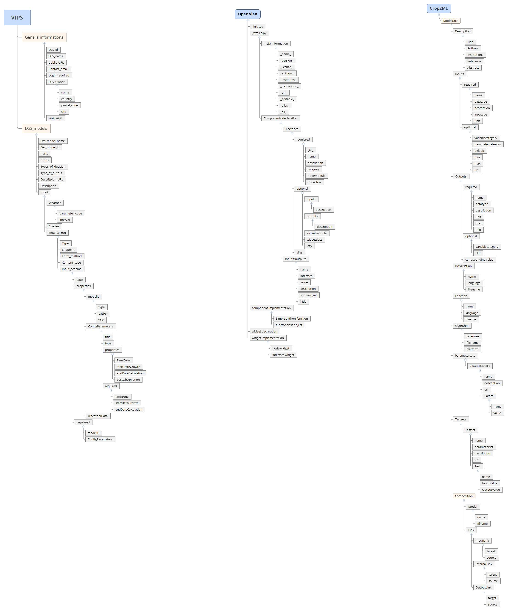

# Fields

## 1. General information about DSS

- [ ] DSS_id:
- [ ] DSS_name:
- [ ] Public URL:
- [ ] Contact_email:
- [ ] login_required: (true or false)
- [ ] DSS_owner:
  - [ ] name:
  - [ ] country:
  - [ ] adress:
  - [ ] postal_code:
  - [ ] city:
  - [ ] Languages:

## 2. Specific model description

There may be many DSS models per DSS

They should have their separate list entry

We use EPPO codes (<https://gd.eppo.int/)>

For pests and crops We use these parameters/codes for weather data: <https://github.com/H2020-IPM-Decisions/formats/blob/master/weather_data/weather_parameters_draft_v1.txt>

- DSS models:
  - [ ] DSS_model_name:
  - [ ] DSS_model_id:
  - [ ] pests: (code EPPO)
  - [ ] Crops: (Code EPPO)
  - [ ] Type_of_decision:
  - [ ] Type_of_output:
  - [ ] Description_URL:
  - [ ] Description:
  - [ ] Input:
    - [ ] Weather
      - [ ] parameter_code:
      - [ ] interval:
    - [ ] Field_observation:
      - [ ] species: (code EPPO)
  - [ ] How_to_run:
    - [ ] Type
    - [ ] Endpoint:
    - [ ] Form_method: (get or post)
    - [ ] Content_type:
    - [ ] Input_schema:

## 3 graphical comparison of VIPS OpenAlea crop2ML models

**html link:**
file:///C:/Users/mlabadie/Documents/Travail/Cirad/IPM-Project/formats/DSS_metadata/VIPS-crop2ml_openalea.html

## 4. Comparison table VIPS OpenAlea, cropm2ML

| x                          | VIPS-fields        | VIPS | OpenAlea | Crop2ML   |
|----------------------------|--------------------|------|----------|-----------|
| Global informations        |                    |      |          |           |
|                            | DSS_id             |      |          | ModelUnit |
|                            | DSS_name           |      |          |           |
|                            | Public URL         |      |          |           |
|                            | Contact_email      |      |          |           |
|                            | login_required     |      |          |           |
|                            | DSS_owner          |      |          |           |
|                            | - name             |      |          |           |
|                            | - country          |      |          |           |
|                            | - adress           |      |          |           |
|                            | - postal_code      |      |          |           |
|                            | - city             |      |          |           |
|                            | - Languages        |      |          |           |
| Specific model description |                    |      |          |           |
|                            | DSS model          |      |          |           |
|                            | DSS_model_name     |      |          |           |
|                            | DSS_model_id       |      |          |           |
|                            | pests              |      |          |           |
|                            | Crops              |      |          |           |
|                            | Type_of_decision   |      |          |           |
|                            | Type_of_output     |      |          |           |
|                            | Description_URL    |      |          |           |
|                            | Description        |      |          |           |
|                            | Input              |      |          |           |
|                            | - Weather          |      |          |           |
|                            | - - parameter code |      |          |           |
|                            | - - interval       |      |          |           |
|                            | Fields observation |      |          |           |
|                            | - spiecies         |      |          |           |
|                            | How to run         |      |          |           |
|                            | - Type             |      |          |           |
|                            | - Endpoint         |      |          |           |
|                            | - Form_method      |      |          |           |
|                            | - Content_type     |      |          |           |
|                            | - Input_schema     |      |          |           |
